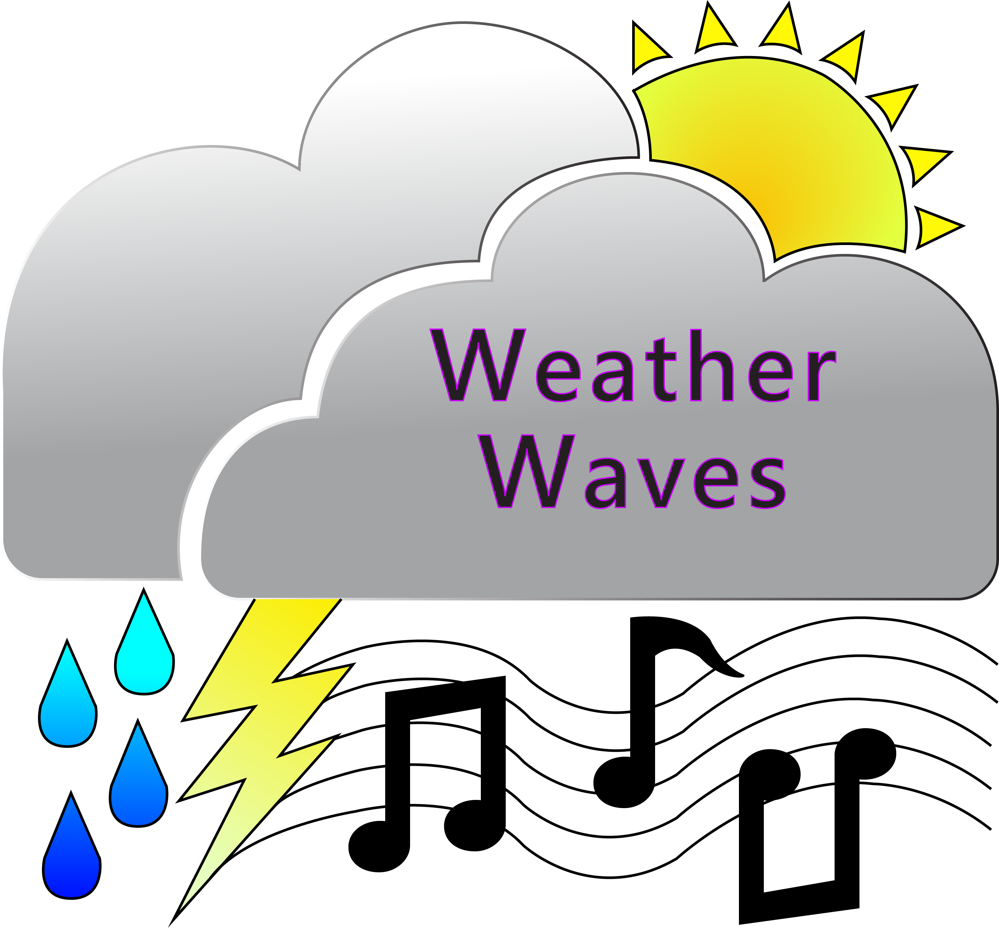

# WeatherWaves



### Intro

WeatherWaves is a project I am developing for Westminster College's Titan Radio. We are hoping to automate various actions resulting from weather conditions such as updating the weather conditions and forecast when no one is on the air and sending out Tweets when there are severe weather warnings.

For the latest updates check out the [WeatherWaves GitHub](https://github.com/alexandermichels/WeatherWaves).

---
**Important Note**

This package is currently under construction while I move things away from WeatherUnderground.
---


### Table of Contents
* [Getting Started](#start)
* [WeatherConnector](#connector)
* [WeatherTweeter](#tweeter)
* [To Do](#todo)

***

### <a id="start">Getting Started</a>

To begin with you're going to want to ensure that you have all of the required packages downloaded. It is *highly* recommended that you use a virtual environment. Once you're ready, you can install all of the packages using pip with this command:

```bash
python -m pip install -r requirements.txt
```

Once you are have everything installed, the next step is to set up a configuration file. The config files are JSON files and can be kept anywhere (you just need to enter the path to the file when instantiating objects). An example config file can be seen below:

```json
{
  "darksky" : {
      "darkskykey": "<Dark Sky API key here>",
      "location" : "<name of city/location>",
      "longitude" : <longitude>,
      "latitude" : <latitude>
  },
  "location" : "<where you are>",
  "name" : "<optional name of business/location>",
  "twitter_keys" : {
      "consumer_key" : "<twitter consumer api key",
      "consumer_secret" : "<twitter consumer api secret>",
      "access_token" : "<twitter access token>",
      "access_token_secret" : "<twitter access token secret>"
  }
}

```

***

### <a id="connector">WeatherConnector</a>

WeatherConnector is an abstract class which utilizes a weather API for fetching the current weather conditions and the forecast in order to produce a plaintext or MP3 weather report. The current iteration is the DarkSkyConnector which utlizes the [Dark Sky API](https://darksky.net/dev). Usage looks like this::

    d = DarkSkyConnector("keys/config.json") # instantiate with "keys/config.json" as the path to config file
    print(d.get_report_string()) # print the "weather report"
    d.write_all() # write the JSON and weather report to the folder

##### Required Configuration File

```json
{
  "darksky" : {
      "darkskykey": "<Dark Sky API key here>",
      "location" : "<name of city/location>",
      "longitude" : <longitude>,
      "latitude" : <latitude>
  },
  "location" : "<where you are>",
  "name" : "<optional name of business/location>"
}

```

***

### <a id="tweeter">WeatherTweeter</a>

WeatherTweeter uses the [Twitter API](https://python-twitter.readthedocs.io/en/latest/index.html) to send select weather updates to Twitter. Currently just checks for alerts such as Severe Weather Warnings and tweets a brief synopsis including a description of the event (for example "Severe Thunderstorm Warning") and the time at which the warning expires. I am working to add more flexibility to this. Typical usage::

    d = DarkSkyConnector("keys/config.json") # make WeatherConnector
    tweeter = WeatherTweeter("keys/config.json", d) # make WeatherTweeter
    tweeter.print_alerts() # check for alerts and print them

Example outputs from WeatherTweeter can be found below. The first is an example of a Tweet send in which there was only one alert and the second is an example in which there were multiple. These are both real Tweets captured on June 22nd.

> The National Weather Service has issued a Flash Flood Watch for the Richmond area which expires 12:00 AM on June 23, 2018. Stay safe!

>The National Weather Service has issued the following for the Tallulah area:\
Tornado Warning which expires 4:30 PM CDT on June 22, 2018\
Severe Thunderstorm Watch which expires 7:00 PM CDT on June 22, 2018\
Stay safe!

##### Required Configuration File

Below represents the minimal requirements for a WeatherTweeter object:

```json
{
    "twitter_keys" : {
        "consumer_key" : "<twitter consumer api key",
        "consumer_secret" : "<twitter consumer api secret>",
        "access_token" : "<twitter access token>",
        "access_token_secret" : "<twitter access token secret>"
    }
}
```

***

### <a id="todo">To Do</a>

Immediate concerns:
* Update the code and documentation to get rid of WeatherUnderground

Goals:
* Transfer everything to config files
* Add logging
* Add ability to personalize (greetings, etc.)
* Expand functionalities
